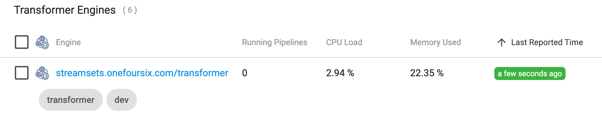

# transformer-k8s-ingress-nginx

### Overview
This project provides an example of deploying one or more instances of [StreamSets Transformer Engine](https://streamsets.com/products/dataops-platform/transformer-etl-engine/) on Kubernetes using an [ingress-nginx](https://kubernetes.github.io/ingress-nginx/) Ingress Controller for use with [StreamSets DataOps Platform](https://streamsets.com/products/dataops-platform/). Multiple instances of Transformer can be installed within the same namespace, or across multiple namespaces. This example will install three instances of Transformer within the same namespace.

### Prerequisites
* API Credentials for an admin account on DataOps Platform
* [jq](https://stedolan.github.io/jq/) must be installed on the machine where this project's scripts are run
* [uuidgen](https://man7.org/linux/man-pages/man1/uuidgen.1.html) must be installed on the machine where this project's scripts are run
* [envsubst](https://linux.die.net/man/1/envsubst) must be installed on the machine where this project's scripts are run. Most systems will have ````envsubst```` installed by default.
* The [ingress-nginx](https://kubernetes.github.io/ingress-nginx/) Ingress Controller must be installed in advance (see below)
* The Kubernetes namespace must be created in advance (see below) 

### Deploy the Ingress Controller
Follow the steps [here](https://kubernetes.github.io/ingress-nginx/deploy/) to deploy ````ingress-nginx```` on your cluster.  If your Kubernetes cluster is on a public cloud, use a Load-Balancer type deployment, else use a NodePort. For this example I will deploy on GKE using a Load-Balancer type Ingress Controller.


### Get the Ingress Controller's External IP
After you have deployed the Ingress Controller, get its external IP:

  

### (Optional) Create a DNS entry for the Ingress Controller's External IP 
To use a hostname rather than an IP address for the Transformer URL, assign an FQDN to the Ingress Controller's external IP by adding an entry to your DNS.  For example, I'll assign the name ````streamsets.onefoursix.com```` to my Ingress Controller's IP address.  If you don't have access to a DNS, you can skip this step and just use the Ingress Controller's IP address instead.

### Create the Kubernetes Namespace
For this example I will create the namespace ````ns1````

````$ kubectl create ns ns1````

### Clone this project to your local machine
Clone this project to your local machine. I'll download the project to my machine at ````~/transformer-k8s-ingress-nginx````

### Set values in conf.sh
Edit the ````conf/conf.sh```` script and set these environment variables (see below for details):

````
# Control Hub Base URL (with no trailing slash)
# Typically https://na01.hub.streamsets.com
SCH_URL=https://na01.hub.streamsets.com

# Control Hub Org ID
SCH_ORG_ID=<YOUR ORG ID>

# Control Hub user CRED ID 
CRED_ID=<YOUR CRED ID>

# Control Hub user CRED TOKEN 
CRED_TOKEN=<YOUR CRED TOKEN>

## Load Balancer HostName or IP
LOAD_BALANCER_HOST_NAME=<YOUR LOAD BALANCER HOSTNAME OR IP>
````

Important points:

* The ````CRED_ID```` and ````CRED_TOKEN```` should be generated for a Control Hub Account with Provisioining Role, typically an administrator.


* The ````LOAD_BALANCER_HOST_NAME```` must correspond to the Ingress Controller's External IP or hostname as described above. For this example I'll use the hostname ````streamsets.onefoursix.com````


### Execute the script deploy-transformer.sh with the desired arguments
To deploy a single instance of Transformer, execute the script ````deploy-transformer.sh```` with the following arguments (in order):
* transformer-namespace
* transformer-name 
* transformer-image 
* port-number
* transformer-labels

For example:
````
$ ./deploy-transformer.sh \
        ns1 \
        transformer \ 
        streamsets/transformer:scala-2.12_4.2.0 \
        19630 \
        transformer,dev
````


### Confirm that Transformer is heartbeating to Control Hub
After a minute or so, you should see the instance of Transformer has registered and is heartbeating to Control Hub:

  

### Confirm that Transformer is Accessible
Create a new pipeline and make sure Transformer is accessible for Authoring:

  

### Create and Run a Pipeline on Local Spark
Create and run a pipeline on local Spark (which uses the Spark tarball packaged in the Transformer container):

  
  
You should see metrics and status in the UI:

  

### Create and Run a Pipeline on a remote Spark Cluster 
Create and Run a Pipeline on a remote Spark Cluster to confirm the callback URL is reachable.  For example, I'll run the same pipeline on Databricks and see the status and metrics returned from Databricks:

  


